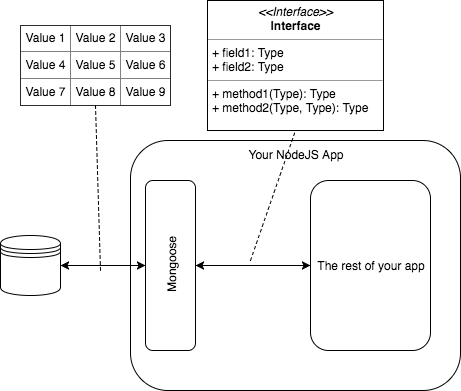

# FSJS Week 5 - Mongo!!!!

**Outline**

1. Sign up for mLab and create a database
2. Set up for week5
3. Create a model and seed it with data
4. Connect Mongo to our application

## 1. Sign up for mLab and create a database
 ### **Only complete this step if you didn"t complete it in the first week**
 * https://mlab.com/signup/
 * Once you"ve logged in, click create new
 * Select "SANDBOX" for your plan type, and use any Cloud Provider -- I"d recommend Amazon Web Services
 * Select US East (if you picked AWS, otherwise pick the closest region)
 * Name your database whatever you"d like
 * Click submit order
 * Open your database by clicking on it"s name
 * Click users -> Add database user
    * This is different from your mLab account! Each database has their own set of users.
 * Create a username and password for your database. It doesn"t matter what this is.
 * Make note of the url under the text that says `To connect using a driver via the standard MongoDB URI`
   * It should look something like this: `mongodb://<dbuser>:<dbpassword>@ds225840.mlab.com:25840/my-database`

## 2. Setup Project
_It should still be setup from *week 4* branch_

1. Clean the project
_If you did something you want to keep, last week, you can make a branch and commit, or copy those files out.  To continue here, we are going to grab the week2 branch._
```
cd FSJS-class-project
git status
git add .
git commit -m "My commit message"
git checkout --track origin/week5
```

4. Install dependencies
```
npm install
```

5. Install mongoose
```
npm install mongoose --save
npm install dotenv --save
```
**Mongoose Documentation:** http://mongoosejs.com/docs/api.html 
**dotenv Documentation:** https://github.com/motdotla/dotenv

## HOLD THE PHONE...
**What is Mongo? Sounds like a cartoon character"s name...**

Mongo is a database.  It is a place to store structured data so that your application can quickly and easily find it later.  Mongo is known as a no-SQL database. In the case of Mongo, that means that it stores data in units called `documents` - which look just like javascript objects (key-value pairs, nested objects, arrays, etc.).

## WAIT A MINUTE....
**What is this `mongoose` of which you speak?**

Mongoose is an ORM (Object Relational Mapping) tool.  It is used in your application to make the process of querying, inserting, updating, and deleting data in a Mongo database.  In addition, it turns the plain ol" javascript objects you get back from Mongo in to more feature-rich objects for your application to use.



## WHAT IS DOTENV?!

Dotenv let's you pull environmant variables, defined in a special file, in to your application.  
Environment variables are `key=value` pairs that are stored by your operating system.

### WHY, OH WHY ARE WE DOING THIS?!
You have a username and password for your database, right? This is sensitive information that you don't want the world to know. BUT you still have to put it in your database somewhere.
**If you put usernames and passwords in a config file and commit that files to your repository, your credentials will be publically viewable on your github page!**

So how do you store sensitive information?

1. Put your credentials in a file called `.env` (note the dot '.').
2. Make sure the `.env` file is **NOT** committed to your repository by editing your `.gitignore` file
3. Use `dotenv` to add those credentials to the local system's list of environment variables.
4. Make use of the varable anywhere you want using Node's global variable `process.env.YOUR_VARIABLE`

### Details...
1. Create a `.env` file in your root directory
```
DB_HOST=<db host>
DB_NAME=<db name>
DB_USERNAME=<db username you created for mlab>
DB_PASSWORD=<password for the mlab db user>
```

2. Update your `.gitignore` file so that the `.env` file is NOT committed to your repository by adding the following:
```
.env
```

3. (and 4.) Edit your config file (`src/config/index.js`) to trigger dotenv and to pull your credentials from the environment.
```javascript
require('dotenv').config();

module.exports = {
  appName: 'Our Glorious Node Project',
  port: 3030,
  db: {
    username: process.env.DB_USERNAME,
    password: process.env.DB_PASSWORD,
    host:     process.env.DB_HOST,
    dbName:   process.env.DB_NAME,
  },
};
```

### So how do other people connect to the database?
You have to give them a username and password using some other means.  Any of these will do:
* Email your `.env` to whomever needs the credentials
* Some secure file transfer
* Slack it to them
* Call them on the phone
* Carrier pigeon

**When you turn in your CodeLouisville Project, you will need to provide your dotenv file to your mentors**

## Create a model using mongoose

**In a nutshell, we will:**
1. Tell mongoose how to talk to the mongo server
2. Make sure mongoose connects to mongo when your application starts.
3. Create a "model" in mongoose.  This is where you define what your data looks like.
4. Use Mongo in our route handlers instead of the array we"ve been using.
5. Add some test data.

### Configure our app to work with mongo
1. Connect to mongo through the mongoose library.  
In `src/server.js`, somewhere near the top of the file, import mongoose with the following.  Note that when we connect to the mongo server, we are piecing together the connection string handed to us by mLab.
```javascript
// Load mongoose package
const mongoose = require('mongoose');
```
Then, somewhere AFTER the line where you load your configuration, connect with the following
```javascript
// Connect to MongoDB and create/use database as configured
mongoose.connection.openUri(`mongodb://${config.db.username}:${config.db.password}@${config.db.host}/${config.db.dbName}`);
```

### Build the model

1. In the `src/models` directory, create an empty file called `shirt.model.js`
2. At the top of that file, pull in mongoose
    ```javascript
    // Load mongoose package
    const mongoose = require("mongoose");
    ```

3. Create a schema
    ```javascript
    const ShirtSchema = new mongoose.Schema({
      name: String,
      description: String,
      price: Number,
      created_at: { type: Date, default: Date.now },
    });
    ```
    Notice that the `name` and `description` fields are also present in our faked data (`/src/routes/index.js`).  We"ve also added a new field called `created_at`, which will be a Date and will default to the current time.

4. Turn that schema in to a mongoose model, register it, and export it
    ```javascript
    const Shirt = mongoose.model("Shirt", ShirtSchema);
    module.exports = Shirt;
    ```
    A lot is going on here.  We are storing the `Shirt` schema inside the mongoose object (which will make it available anywhere in your application).  We"re also giving a name ("Shirt") so we can distinguish it from any other model we may want to register.  We"re also exporting the model from this module.

5. Make sure that the `shirt.model.js` script is run by `require`-ing it somewhere...like in `src/server.js`, below the line where we connect mongoose to mongo:
    ```javascript
    // Import all models
    require("./models/shirt.model.js");
    ```

## Connect to our app
1. In `src/routes/index.js`, pull in mongoose at the top of the file.
    ```javascript
    const mongoose = require("mongoose");
    ```

2. Edit the `GET /shirt` route.  Replace our development code with
    ```javascript
    mongoose.model("Shirt").find({}, function(err, shirts) {
      if (err) {
        console.log(err);
        return res.status(500).json(err);
      }

      res.json(shirts);
    });
    ```
    **Model.find:** http://mongoosejs.com/docs/api.html#model_Model.find

3. Restart server and test - **Where did our data go?**

### What about some test data?
Strategy: On startup, check if there are any shirts in the database, if not, then add shirts from a seed file.

1. Create a file in `/src/models` called `shirt.seed.json`
    ```json
    [
      {
        "name": "iron man shirt",
        "description": "iron man flying high",
        "price": 9.99
      },
      {
        "name": "cats-r-us",
        "description": "toys-r-us logo saying cats-r-us",
        "price": 8.99
      },
      {
        "name": "coffee",
        "description": "a cup of coffee elegantly portrayed",
        "price": 11.99
      },
      {
        "name": "dogs",
        "description": "need i say more?",
        "price": 89.99
      },
    ]
    ```

2. In `shirt.model.js`, after you create and export the model, get the current count of documents in the collection
    ```javascript
    Shirt.count({}, function(err, count) {
      if (err) {
        throw err;
      }
      // ...
    });
    ```
    **Model.count:** http://mongoosejs.com/docs/api.html#model_Model.count

3. Add the seed data
    ```javascript
    if (count > 0) return ;

    const shirts = require("./shirt.seed.json");
    Shirt.create(shirts, function(err, newShirts) {
      if (err) {
        throw err;
      }
      console.log("DB seeded")
    });
    ```
    **Model.create:** http://mongoosejs.com/docs/api.html#model_Model.create
